# Online Initialization for Monocular Visual-Inertial-LiDAR System with Extrinsic Calibration and Software Time Synchronization
##  Hardware introduction
Our VILS is a self-assembled handhold device, it consists of the following:
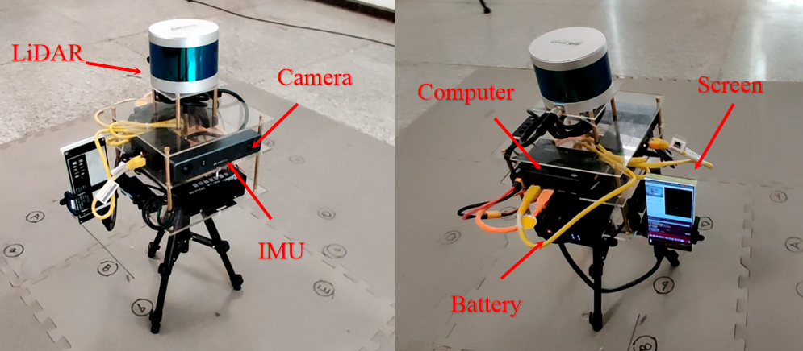
- MYNTEYE-D120 VI sensor                            https://www.mynteye.com/pages/mynt-eye-d
- LeiShen-C16 3d spinning LiDAR                     https://www.leishen-lidar.com/
- DJI-Manfold2-c mini PC with i7-8559U processor    https://www.dji.com/cn/manifold-2
- PocketLCD Screen                                  https://github.com/peng-zhihui/PocketLCD
- Battery                                           https://store.dji.com/cn/product/matrice-100-tb47d-battery

##  DataSets
### indoor
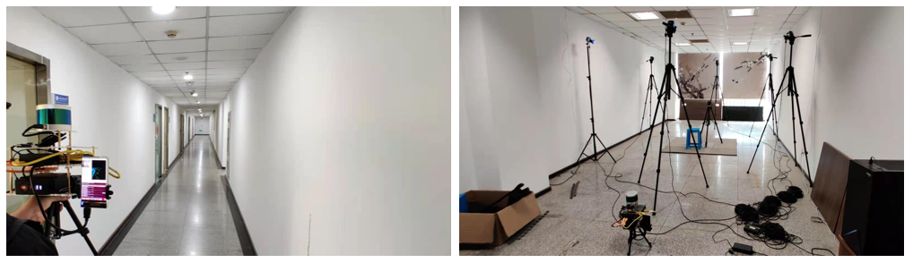

### outdoor
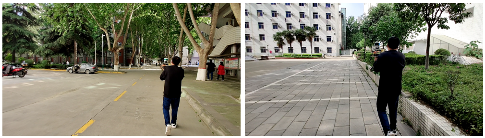

### Description
| name | size |
| :-----| ----: |
| indoor.bag | 3.84G | 
| outdoor.bag | 7.56G | 
| FourMinuteIndoor.bag | 25.04G | 
### Topic:
- imu_topic: `/mynteye/imu/data_raw`        200hz
- image_topic: `/mynteye/left/image_mono`   30hz
- lidar_topic: `/lslidar_point_cloud`       5/10hz

The datasets are avaliable here:
Link：https://pan.baidu.com/s/1quMoph8gzQdlNboWlgLDZw 
pin：gwnm 

##  Demo
### indoor

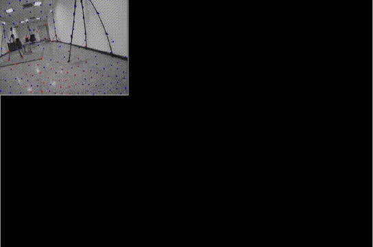
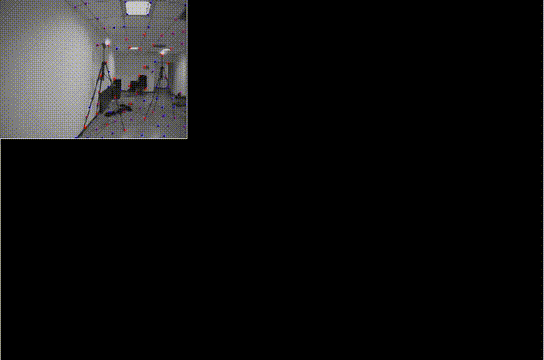

### outdoor

##  comparison (VI)
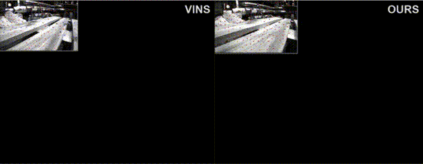
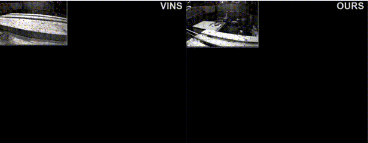
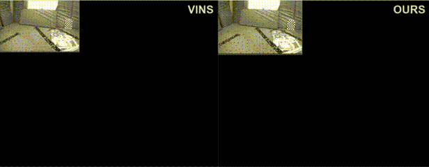
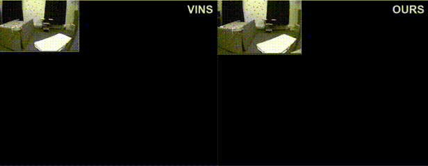
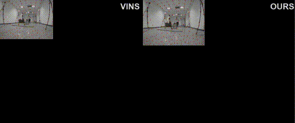

##  different installations 
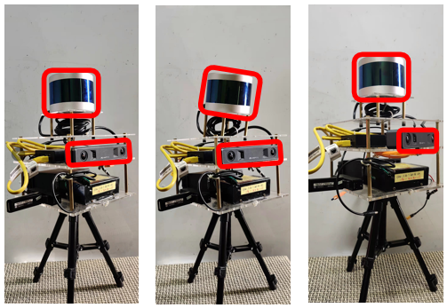

